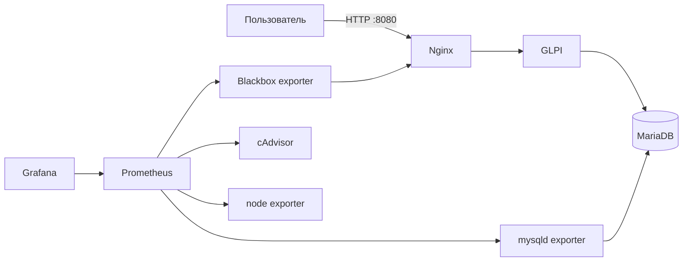

# HelpDesk Platform

Воспроизводимый MVP Service Desk на базе GLPI 11, MariaDB, Nginx, Prometheus и Grafana. Репозиторий показывает не только запуск приложения, но и эксплуатационный цикл: диагностику, мониторинг, резервное копирование, восстановление и автоматическую проверку конфигурации.

Проект рассчитан на локальную демонстрацию и перенос на один Linux VPS. Это не отказоустойчивая корпоративная инсталляция.

## Что входит в MVP

| Компонент | Назначение | Локальный адрес |
| --- | --- | --- |
| GLPI 11 | Заявки, пользователи и активы | http://localhost:8080 |
| MariaDB | Постоянное хранение данных | Только внутренняя сеть Docker |
| Nginx | Единая входная точка и защитные заголовки | http://localhost:8080/healthz |
| Prometheus | Метрики приложения, БД, контейнеров и хоста | http://localhost:9090 |
| Grafana | Готовый дашборд HelpDesk Overview | http://localhost:3000 |
| Blackbox exporter | Проверка HTTP-доступности | Только внутренняя сеть Docker |
| mysqld exporter | Метрики MariaDB | Только внутренняя сеть Docker |
| cAdvisor и node exporter | Метрики контейнеров и Linux-хоста | Только внутренняя сеть Docker |

> **Почему MariaDB, а не PostgreSQL.** Исходная спецификация упоминала PostgreSQL, но GLPI официально поддерживает только MySQL и MariaDB. В MVP используется MariaDB, чтобы стенд действительно запускался и поддерживал штатное автоустановочное поведение официального образа GLPI.

## Быстрый старт

Требования: Docker Engine 24+ с Compose v2, GNU Make, `curl`, `gzip` и `sha256sum`. На Windows используйте WSL 2 с интеграцией Docker Desktop.

```bash
cp .env.example .env
```

Замените все значения `change_me_*` в `.env`, затем запустите стек:

```bash
make config
make up
make health
```

Первый запуск обычно занимает несколько минут: MariaDB и GLPI создают схему данных, а Docker загружает образы. После состояния `healthy` откройте http://localhost:8080.

Стандартная первая учётная запись GLPI — `glpi` / `glpi`. Сразу смените пароль и не публикуйте стенд с тестовыми данными.

## Команды оператора

```bash
make status                  # состояние контейнеров
make health                  # здоровье приложения и базы
make logs SERVICE=glpi       # последние логи и подписка на новые
make restart SERVICE=nginx   # перезапуск одного компонента
make backup                  # БД и файлы GLPI в backups/<UTC timestamp>
make restore BACKUP=backups/20261001T120000Z
make down                    # остановка с сохранением volumes
```

Восстановление требует точного интерактивного подтверждения имени целевой базы. Контрольные суммы проверяются до изменения данных.

## Архитектура



`backend` изолирует GLPI и базу, `monitoring` связывает систему наблюдаемости, а наружу публикуются только Nginx, Prometheus и Grafana. По умолчанию порты привязаны к `127.0.0.1`.

Подробности: [архитектура](docs/architecture.md), [установка](docs/setup.md), [операции](docs/operations.md), [резервное копирование](docs/backup-restore.md).

## GitHub Actions

Workflow `.github/workflows/validate.yml` выполняет:

1. проверку структуры репозитория;
2. ShellCheck для эксплуатационных скриптов;
3. проверку YAML и JSON;
4. `docker compose config`;
5. синтаксическую проверку Nginx и Prometheus;
6. полный smoke test стека для pull request и ручного запуска.

Workflow не деплоит сервис и не использует рабочие секреты. Для ручной проверки откройте вкладку **Actions**, выберите **Validate helpdesk platform** и нажмите **Run workflow**.

## Структура

```text
helpdesk-platform/
├── .github/workflows/validate.yml
├── config/
│   ├── blackbox/blackbox.yml
│   ├── nginx/default.conf
│   └── prometheus/prometheus.yml
├── docs/
│   ├── runbooks/
│   ├── architecture.md
│   ├── backup-restore.md
│   ├── operations.md
│   └── setup.md
├── monitoring/grafana/
│   ├── dashboards/helpdesk-overview.json
│   └── provisioning/
├── scripts/
│   ├── backup.sh
│   ├── common.sh
│   ├── healthcheck.sh
│   └── restore.sh
├── tests/validate_repo.sh
├── .env.example
├── compose.yaml
├── Makefile
└── README.md
```

## Границы и безопасность

- Single-node: отказ Docker-хоста останавливает весь сервис.
- TLS не включён. Для VPS добавьте доверенный домен, сертификат и ограничения доступа до смены `BIND_ADDRESS`.
- Образы закреплены версиями в `.env.example`; обновляйте их отдельным изменением и прогоняйте CI.
- `.env`, бэкапы и runtime-данные исключены из Git.
- Перед реальным использованием настройте SSO/LDAP, роли, почтовый шлюз, внешнее хранение бэкапов, контроль доступа и регулярные обновления.

Официальные источники: [GLPI Docker images](https://github.com/glpi-project/docker-images), [GLPI installation documentation](https://glpi-install.readthedocs.io/), [Prometheus](https://prometheus.io/docs/), [Grafana](https://grafana.com/docs/grafana/latest/).
