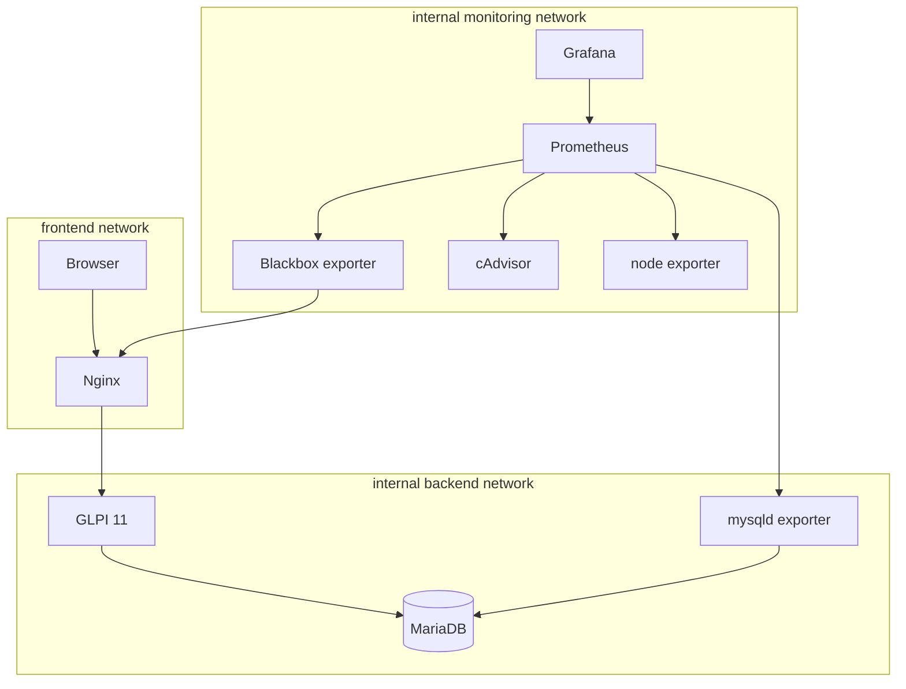

# Архитектура HelpDesk Platform

## Решение

MVP разворачивается как один Docker Compose project. Nginx принимает пользовательский HTTP-трафик, GLPI обрабатывает запросы, MariaDB хранит записи, а отдельный контур мониторинга собирает технические метрики.

Исходный документ предлагал PostgreSQL. Это несовместимо со штатными требованиями GLPI: официально поддерживаются MySQL и MariaDB. Для работоспособного MVP выбрана MariaDB 11.8. Эта замена сохраняет цель документа — отдельную постоянную БД — без создания неподдерживаемого форка приложения.

## Потоки

## Данные

| Volume | Данные | Входит в штатный бэкап |
| --- | --- | --- |
| `db_data` | Таблицы MariaDB | Да, как логический SQL dump |
| `glpi_data` | Конфигурация, marketplace, документы и журналы GLPI | Да, как tar.gz |
| `prometheus_data` | Временные ряды за 15 дней | Нет |
| `grafana_data` | Локальное состояние Grafana | Нет; dashboard и datasource описаны кодом |

Prometheus и Grafana восстанавливаются из конфигурации. Бизнес-данные GLPI и загруженные файлы резервируются вместе.

## Границы доверия

- `backend` и `monitoring` объявлены internal и не маршрутизируются наружу.
- По умолчанию публикуемые порты слушают только `127.0.0.1`.
- Секреты поступают из локального `.env`, который исключён из Git.
- Nginx добавляет базовые защитные заголовки, но не завершает TLS.
- Контейнеры используют лимиты памяти и процессов; cAdvisor требует расширенных прав для чтения метрик Docker-хоста.

## Отказоустойчивость

Каждый долгоживущий контейнер имеет restart policy и healthcheck. Зависимости запуска используют состояния `service_healthy` или `service_completed_successfully`. Архитектура остаётся single-node: отказ хоста, Docker daemon или диска влияет на весь сервис.

## Путь к production

Перед внешней публикацией нужны TLS, внешний контроль доступа, ротация секретов, вынос бэкапов на другой носитель, регулярное тестовое восстановление, алерты, централизованные логи и план обновления GLPI. Высокая доступность БД и нескольких экземпляров приложения не входят в MVP.
